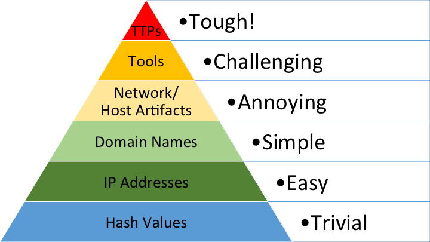

:detective_tone4:

## DE Philosophies

* https://br0k3nlab.com/resources/axioms-of-security-and-rule-based-capabilities/

* https://br0k3nlab.com/resources/zen-of-security-rules/

## Cloud Focused MITRE Tactics & Techniques 
Rather than document the entire MITRE framework I thought I would highlight a few cloud specific IDs.

=== "Discovery - TA0007"
Learning information about your environment.

    Cloud Service Discovery (T1526) - using a cloud API service to identify what services are available.
    Cloud Infrastructure Discovery (T1580) - Looking for resources that are a part of the service.
    Cloud Storage Object Discovery (T1619) - enumerating objects within cloud storage.

=== "Defense Evasion - TA0005"
    
    Modify Cloud Compute Infrastructure (T1578) - modify compute service to evade defense.

## Detection as Code Resources

    https://www.datadoghq.com/blog/datadog-detection-as-code/#:~:text=Our%20Threat%20Detection%20team%20uses,runtimes%20(CSM)%2C%20respectively

    https://www.elastic.co/blog/detections-as-code-elastic-security

    https://panther.com/cyber-explained/detections-as-code/#get-started

    https://www.googlecloudcommunity.com/gc/Community-Blog/Getting-Started-with-Detection-as-Code-and-Chronicle-Security/ba-p/702154

    

## Detection Rule Repositories

    https://github.com/SigmaHQ/sigma/tree/master/rules
    https://github.com/elastic/detection-rules/tree/main/rules
    https://github.com/splunk/security_content/tree/develop/detections
    https://github.com/panther-labs/panther-analysis/tree/develop/rules

## General DE Blogs & Resources

    https://www.elastic.co/security-labs/topics/detection-science
    https://www.elastic.co/security-labs/primer-on-persistence-mechanisms
    https://www.elastic.co/security-labs/sequel-on-persistence-mechanisms
    https://redcanary.com/blog/linux-security/detection-engineer-guide-to-linux/
    https://www.wiz.io/blog/cloud-logging-tips-and-tricks
    https://chesterlebron.blogspot.com/2024/08/my-methodology-to-aws-detection-engineering-part-1.html
    https://research.splunk.com/
    https://lolol.farm/
    
    

## SIEM Engineering

=== "Parsing"
https://regexr.com/

## Threat Modeling
