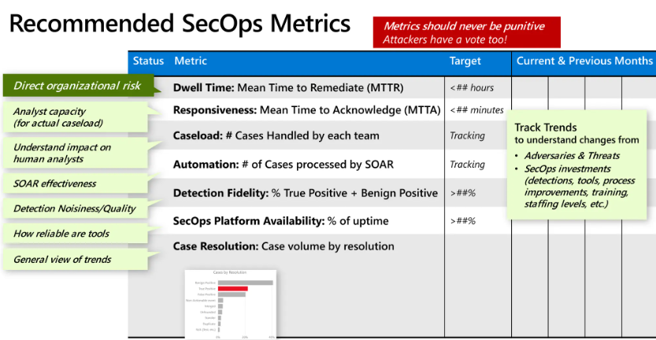

## SOAR

## Efficiency 
Anything that has been or can be useful to me dealing with cloud SOC duties.

### jq - JSON parser
* lightweight CLI tool
* Makes JSON easier to work with and visualize
* Similar to sed, can pipe with other commands through STDOUT
* Can change JSON data by filtering, slicing, mapping, and transforming

## Metrics

## Gen AI Use Cases 

=== "Incident Response"
* Iterative Prompting
* Scripting
* 
=== "Security Operations"
* AI analysis in playbooks
* 
=== "Detection Engineering"
* Use case development

## Resources
* https://www.googlecloudcommunity.com/gc/SecOps-SOAR/Part-1-Dipping-Your-Toe-into-SOAR-Understanding-the-Basics/td-p/717159
* https://github.com/jqlang/jq
* https://www.mockaroo.com/
* https://redcanary.com/blog/security-operations/genai-identity-threat-detection/
* https://medium.com/@dylanhwilliams/utilizing-generative-ai-and-llms-to-automate-detection-writing-5e4ea074072e
* https://redcanary.com/blog/security-operations/genai-security-operations/

## Helpful cloud tools
* https://github.com/duo-labs/cloudmapper
* https://github.com/PrateekKumarSingh/AzViz
* https://cloud.google.com/network-intelligence-center/docs/network-topology/concepts/overview
* 
